# Data Flow — đường đi query theo role

Tài liệu mô tả **đường đi vật lý** của 1 query khi user chạm UI, cho 3 role chính: customer, support, admin. Mỗi role đi qua tầng khác nhau và mỗi tầng làm 1 việc khác lên payload.

## Sơ đồ tổng thể

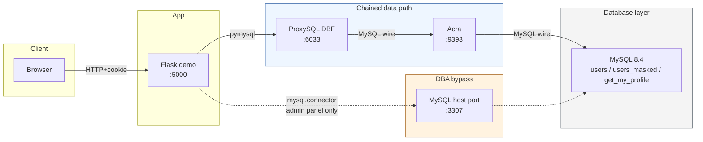

3 endpoint khác nhau:

| Endpoint | Port | Khi nào dùng |
|---|---|---|
| ProxySQL chained | `127.0.0.1:6033` | Customer + Support — mọi truy cập app-level |
| MySQL direct | `127.0.0.1:3307` | Admin panel "Storage sample" — chứng minh ciphertext at rest |
| ProxySQL HA-router admin | `127.0.0.1:6452` | Admin panel "Database cluster" — chỉ đọc topology |

---

## 1. Customer (Alice, Bob) — `/profile`

Khách hàng đọc hồ sơ của chính mình. App gọi stored procedure với token bound to session.

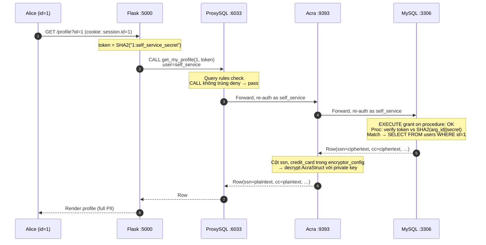

### Khi Alice thử IDOR `?id=2`

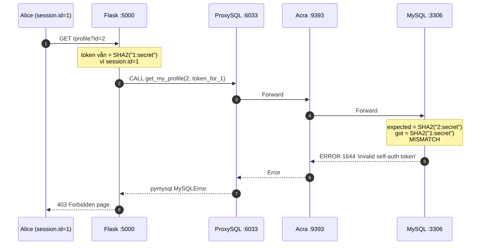

**Note**: Token = `SHA2(id || ':self_service_secret', 256)` được app tính bằng `session.id`. Đổi URL không đổi được token → DB từ chối → IDOR bị chặn **tại tầng DB**, kể cả app dev quên check ownership.

---

## 2. Support (Carol) — `/support`

Support staff xem danh sách khách. Truy cập qua chain nhưng MySQL identity là `support`, không phải `self_service`.

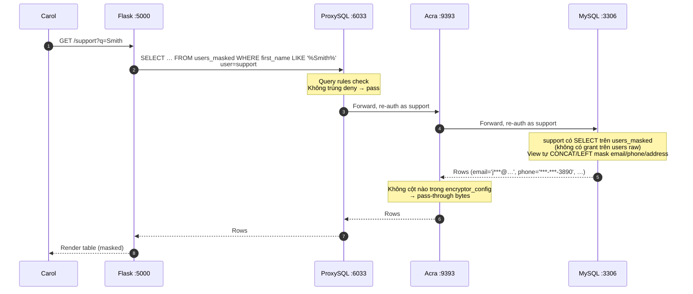

### Khi Carol thử SQL injection trong search box

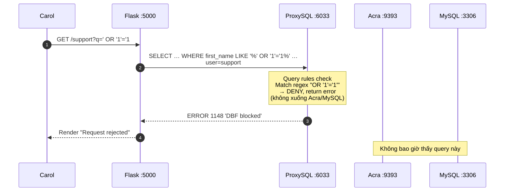

### Khi Carol xem detail và thử raw access

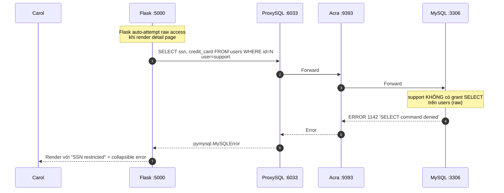

**Note**: Khác customer ở chỗ Carol không dùng stored procedure — Carol có grant trực tiếp trên `users_masked` view. View đã tự mask cho mỗi cột Tier 2. Tier 1 (ssn/cc) không có trong view → Carol không reach được, dù qua chain hay không.

---

## 3. Admin (Dave) — `/admin`

Admin có 4 panel, mỗi panel đi đường khác nhau.

### 3a. "Storage sample" panel — DBA direct, no proxy, no Acra

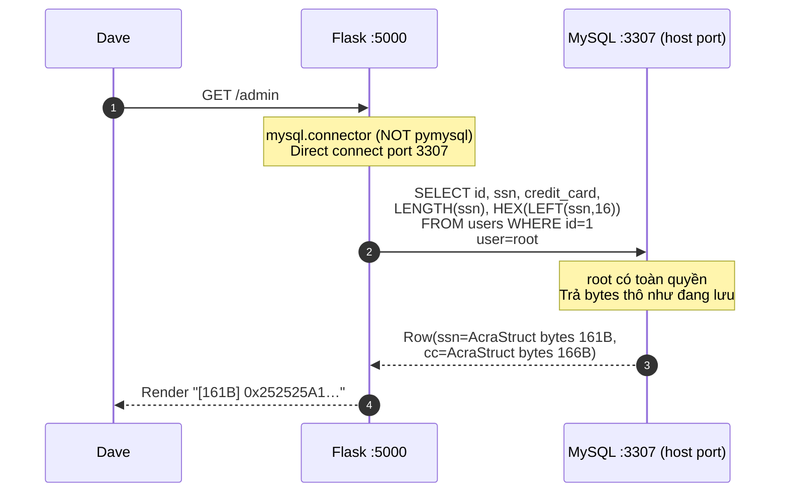

**Key**: bypass cả ProxySQL lẫn Acra → DBA thấy chính xác cái MySQL lưu trên disk. Vì không qua Acra → không có key → chỉ thấy ciphertext bytes. **Đây là separation of duties cụ thể**: DBA quản DB nhưng không giữ key.

### 3b. "Database cluster" panel — query ProxySQL HA-router admin

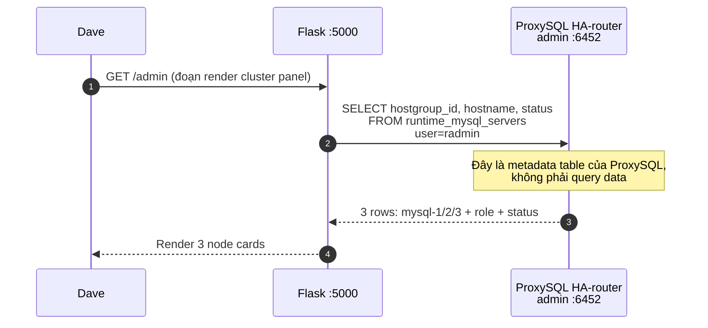

**Note**: Đây là query **vào chính ProxySQL** chứ không phải qua nó. Trả về topology cluster, không động đến data tables.

### 3c. "Stop node" — gọi docker

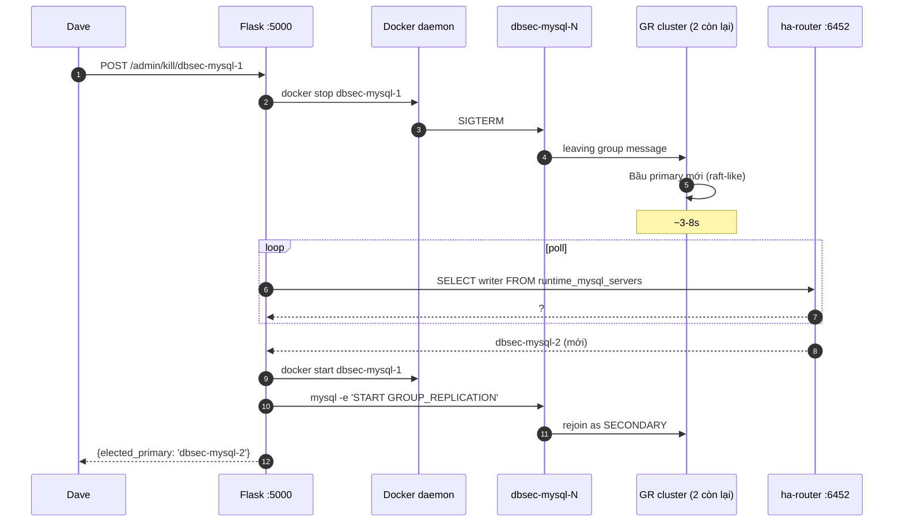

**Note**: Không có query data nào ở đây — chỉ docker control plane + ProxySQL admin probe.

### 3d. "Load testing" — Phase 5 stress qua chain

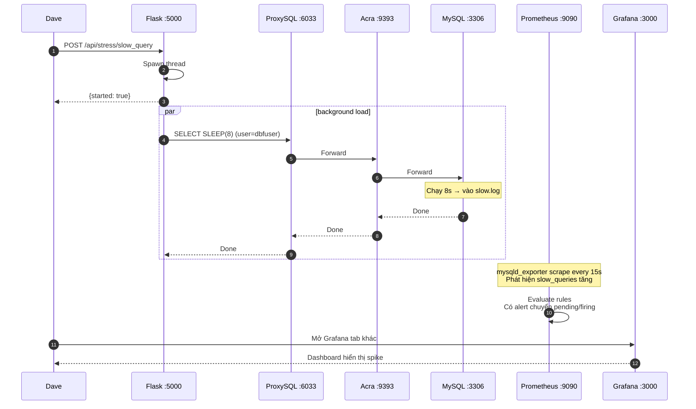

**Note**: Stress query đi qua chain bình thường, nhưng đáng quan tâm là cái nó tạo ra — slow query log + connection spike — được Prometheus thấy qua mysqld_exporter (kênh observability riêng, không qua Flask).

### 3e. "Compliance scan" — Phase 6 discovery

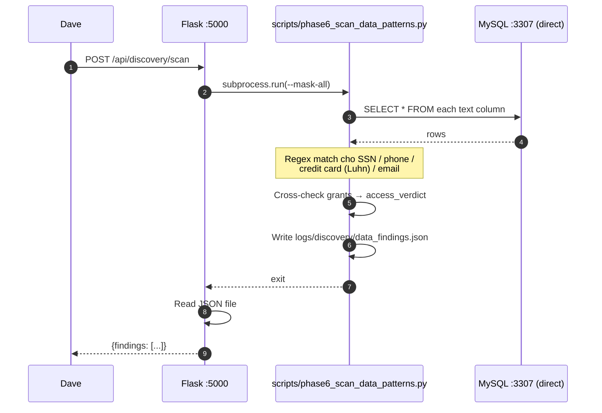

**Note**: Scanner connect direct → không qua chain. Đây là tool admin chứ không phải app traffic.

---

## Tổng kết — 3 role, 3 đường

| | **Customer** | **Support** | **Admin** |
|---|---|---|---|
| MySQL user | `self_service` | `support` | `root` (direct) hoặc `radmin` (ha-router) hoặc `dbfuser` (stress) |
| Endpoint | ProxySQL `:6033` | ProxySQL `:6033` | MySQL `:3307` + ha-router `:6452` + ProxySQL `:6033` |
| ProxySQL DBF | ✓ enforce | ✓ enforce | ✓ enforce (cho stress); skip cho storage/cluster panel |
| Acra encrypt/decrypt | ✓ decrypt ssn/cc | passthrough (view không có cột encrypted) | skip cho storage panel → thấy ciphertext |
| RBAC MySQL | EXECUTE on proc only | SELECT on `users_masked` only | full root |
| Defense per query | proc + token check | view masking + grant deny on raw users | none on direct path — chỉ encryption at rest bảo vệ |
| Cố thử IDOR | bị token check chặn | n/a | n/a (root đọc được mọi id) |
| Cố thử SQLi | ít gặp (proc args) | bị DBF chặn ở ProxySQL | có thể bypass DBF qua port 3307 — nhưng vô dụng vì ssn/cc đã encrypt |

### Điểm tinh tế

- **Cùng physical chain** cho customer + support — chỉ MySQL identity khác. ProxySQL pass-through username (không terminate auth) → MySQL áp đúng RBAC.
- **Admin có 3 đường khác nhau** trong cùng 1 page: direct MySQL (storage), ha-router admin (cluster), chain (stress). Không phải mọi action admin đều bypass — bypass chỉ là cho operations.
- **Acra chỉ kích hoạt** khi query đụng cột trong `encryptor_config.yaml` (`users.ssn`, `users.credit_card`). Mọi cột khác → pass-through.
- **DBF chỉ trên ProxySQL** — bypass ProxySQL (port 3307) thì không có firewall. Defense in depth bù lại bằng encryption at rest cho Tier 1.
